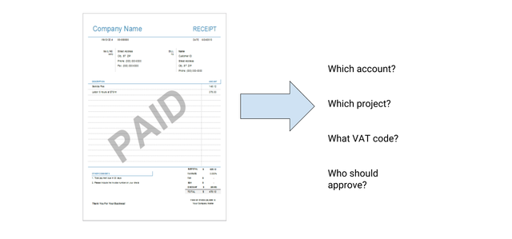
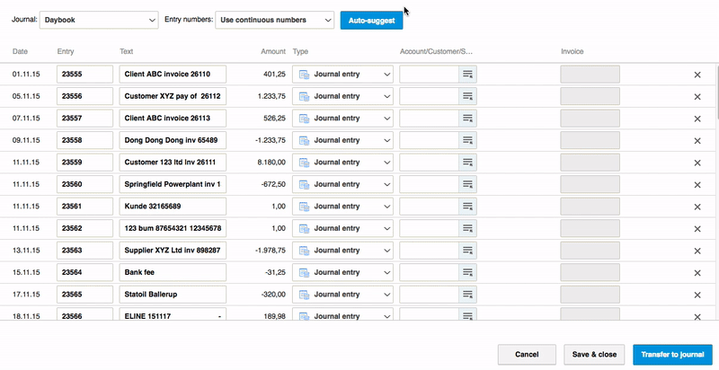

# Autosuggest <small>for intelligent ERP systems</small>

## Automate ERP workflows
Autosuggest is a set of web APIs developed to aid automation in ERP systems.
Often customers of ERP systems are performing the same tasks many times a day,
as an example every invoice have to be booked on some account from the chart of
accounts.
Autosuggest aims to ease these manual tasks, by providing APIs that can give suggestions to the users, so some of that work can be reduced to simply approving what the machine learning predicted.



In the next image we see how Visma e-conomic uses the Autosuggest to fill out
accounts for a customer based on bank transfer statements.



## A quick API example

We have demo datasets for all our APIs, the only thing you need to get started
is to contact [Claus Dahl](mailto:claus.dahl@visma.com) for an access key.

!!! todo
    Demo datasets are not yet available

```json
POST /model/scanned-invoice/v2/predict HTTP/1.1
Authorization: Bearer secret-access-token

{
    "dataset": "user/3124232",
    "input": [{"description": "Taxi til kundemøde"}],
    "targets": ["account"]
}

HTTP/1.1 200 OK
Content-Type: application/json

{
    "predictions": [{"account": [{"confidence": 0.19, "label": "3620"}]}]
}
```

That is all for calling the api. But we made an assumption here!  We used the
preuploaded dataset `user/3124232`.

Customers behave differently when using your application and therefore we need
a per user dataset to learn their specific behaviour.
We exchange user datasets using our secure s3 as shared storage facility. When
we handle your data it is always encrypted at rest (with Hardware Security
Modules) and in transfer (TLS) with state of the art encryption solutions.
